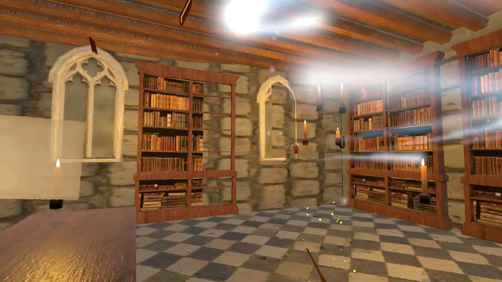

# VizaRding Quest


## Introduction
Set in a fictional magical world inspired by the Harry Potter series, this Mixed Reality (VR) application offers an immersive experience filled with magical interactions and spell casting. This project is built with Unity and C# by two students in the 6th and 8th semesters in the "Development of Mixed Reality Experiences" module at Fachhochschule Graubünden. 
## Prerequisites
- A PC capable of running VR applications 
- Unity (latest version, 2022.3.20f1 recommended)
- Visual Studio or another compatible C# IDE
- A compatible mixed reality device (we worked with Meta Quest 3) 
- Git (optional, for cloning the repository)
## Installation

### Prerequisites
1. Clone the Repository 
- If you have Git installed, open a terminal or command prompt and run:

```
git clone https://github.com/marielalaba/vizardingquest.git
```

** 2. Open the Project in Unity ** 
- Launch Unity Hub.
- Click on the Add button and navigate to the folder where you cloned/extracted the project.
- Select the project folder and click Open.

3. ** Install Dependencies **
- Unity may prompt you to install/update certain dependencies or packages. Follow the on-screen instructions to install the necessary components.

4. Configure VR Settings
- Open the project in Unity.
- Go to Edit > Project Settings > XR Plug-in Management.
- Ensure the appropriate plug-in provider (e.g., Oculus, OpenVR) is enabled and configured.

5. Build and Run
- Connect your VR headset to your PC and ensure it is set up correctly.
- In Unity, go to File > Build Settings.
- Select your target platform (e.g., Windows) and click Build and Run.
- Choose a location to save the build files, and Unity will compile and launch the application.

## Features

### Wand Interaction
- Grab/Drop Wand: Use the E key to grab the wand game object. Press the E key again to drop it.
- Call Wand: Summon the wand to your location by pressing the C key.

### Player Movement
- Move Player/Controller: Navigate the player or controller using the arrow keys (↑, ↓, ←, →) 
- or WASD keys for directional movement.

### Spell Casting
- Conjure Spell: Hold down the left mouse button (LMB) to cast a spell that causes books to move randomly.
- Incendio: Use the I key to release fire from the wand 

## Screenshots


## Future Plans

- Enhanced gesture tracking for smoother spell execution
- Increased variety of available spells
- Integration of voice input for casting spells
- Compatibility with Meta Quest 3 and VR glasses
## License

This project is licensed under the [MIT](https://choosealicense.com/licenses/mit/)